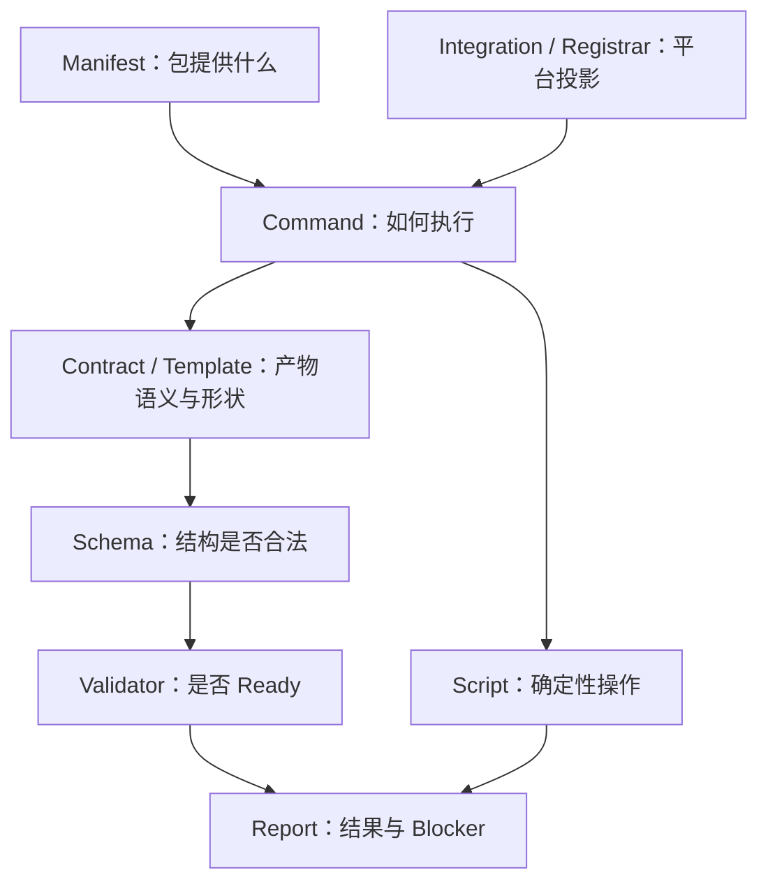

# Preset / Extension 编码规范

本文定义 Spec Kit 中 Preset（预设）和 Extension（扩展）的实现规范。
它面向维护者、贡献者和代码审查者，用于约束新能力设计、提示词编写、
契约资产、平台适配、安装生命周期和测试。

## 1. 适用范围与规范语言

本规范适用于：

- 新增或修改 `extensions/<id>/`。
- 新增或修改 `presets/<id>/`。
- 为 Preset 或 Extension 修改命令注册、模板解析、Hook、安装、更新或移除逻辑。
- 修改 Preset 或 Extension 共用的平台投影能力。

本规范不要求为了处理一个局部 issue 而迁移所有历史代码。新文件必须遵守；
被修改的旧文件必须在本次变更范围内向本规范收敛。发现无关历史问题时，记录
follow-up，不顺手扩大当前 PR。

规范关键词：

- **MUST（必须）**：违反即阻塞合并。
- **MUST NOT（禁止）**：出现即阻塞合并。
- **SHOULD（应当）**：默认遵守；偏离时必须在 PR 说明理由。
- **MAY（可以）**：按场景选择。

## 2. 规则权威顺序

规则冲突时按以下顺序处理：

1. 当前 maintainer 指令和 issue 验收标准。
2. 仓库根目录及目标目录最近的 `AGENTS.md`。
3. Manifest、Schema、Validator 和对应的契约测试。
4. 当前代码、CI workflow 和打包配置所表达的事实。
5. 架构文档、开发文档和用户文档。
6. 历史说明和示例。

README 或旧代码不能单独证明某种模式仍然是推荐规范。若文档与可执行契约冲突，
必须在 PR 中指出，并以更高权威来源为准。

## 3. 先选择正确的扩展点

实现前必须先判断能力属于哪个子系统。

| 需求 | 归属 | 示例 |
| --- | --- | --- |
| 新增命令、外部工具、Hook 或独立能力 | Extension | Jira 同步、PRD intake、架构扫描 |
| 修改现有 SDD 阶段的提示词或产物 | Preset | 为 `/speckit.plan` 增加合规约束 |
| 编排命令顺序、审批、暂停和恢复 | Workflow | specify → review → plan |
| 适配 agent 的目录、格式和调用方式 | Integration | Markdown → TOML 或 `SKILL.md` |
| 打包已有组件 | Bundle | 团队级 Extension + Preset 集合 |

### 3.1 Extension 边界

Extension 用于增加新的功能能力。

Extension MAY：

- 提供 `speckit.<extension-id>.<command>` 命令。
- 提供模板、Schema、确定性脚本、Validator 和配置。
- 通过 Hook 接入核心阶段。
- 调用外部工具，但必须声明依赖并提供失败路径。

Extension MUST NOT：

- 为每个 agent 分别维护一份业务提示词。
- 直接写 `.claude/commands/`、`.agents/skills/`、`.github/agents/` 等平台目录。
- 用 Hook 隐式改变未声明的核心阶段语义。
- 把平台输出格式与功能逻辑耦合。

### 3.2 Preset 边界

Preset 用于覆盖或组合现有 Spec Kit 阶段。

Preset MAY：

- 使用 `replace`、`prepend`、`append` 或 `wrap` 定制现有 command/template。
- 增加现有阶段需要的稳定模板、Schema 和纯 Validator。
- 调整既有阶段的要求、计划、任务或实现协议。

Preset MUST NOT：

- 实现新的外部集成、静态分析器或工作流运行器。
- 引入新的 agent dispatch 层。
- 用 Python 或 shell 脚本编排 Worker、agent 或完整工作流。
- 把本应属于 Extension 的 source intake、provider authentication 或外部工具逻辑
  放进 Preset。

脚本型 Preset 只能包装或替换既有的确定性脚本能力。新增独立能力时必须改用
Extension。

### 3.3 示例

需求：“在 plan 中增加一节 HIPAA 检查。”

- 正确：Preset `wrap` 或 `append` `speckit.plan`。
- 错误：创建 `speckit.hipaa.plan` Extension 并复制整份核心 plan prompt。

需求：“从 Jira 拉取 issue 并生成可追踪输入。”

- 正确：Extension，包含命令、配置、外部工具适配和证据契约。
- 错误：Preset 在 `speckit.specify` 中直接实现 Jira API 调用。

## 4. 分层架构

Preset 和 Extension 必须采用契约优先（contract-first）的分层方式。



| 层 | 负责 | 不负责 |
| --- | --- | --- |
| Manifest | 文件声明、版本、依赖、命令、Hook、组合策略 | 未声明的隐式行为 |
| Command | 输入路由、边界、步骤、验证调用、停止条件、报告 | 完整持久结构、平台适配 |
| Contract | 领域术语、语义约束、证据和归属规则 | agent 执行编排 |
| Template | 稳定章节、表格、占位符和展示结构 | 平台判断、运行时决策 |
| Schema | required、类型、枚举和格式约束 | 自然语言工作流 |
| Validator | 跨字段规则、Readiness、Blocker code | LLM 推理和文件生成 |
| Script | 路径解析、初始化、确定性转换和校验 | 领域决策、agent 调度 |
| Integration | 目标目录、文件格式、参数、命令调用和 CLI dispatch | Preset/Extension 业务规则 |
| Tests | 上述契约的可执行证明 | 只锁定内部实现细节 |

### 4.1 契约权威

不同问题必须有唯一权威：

- 数据结构：Schema。
- 跨字段状态、Readiness 和 Blocker code：Validator。
- 领域语义：Contract。
- 持久文件形状：Template。
- 阶段执行顺序：Command。
- 平台文件格式和命令调用：Integration/Registrar。

Command MUST NOT 重新定义 Schema 字段、Validator 判定或 Template 的完整结构。
当下游需要稳定复用某项内容时，该内容 MUST 从 prompt 抽取为 Contract、Template
或 Schema。

### 4.2 结构化产物

JSON、YAML 或其他机器可读产物 MUST：

- 有对应 Schema。
- 有合法样例和非法样例测试。
- 对 Schema 无法表达的跨字段规则提供 Validator。
- 使用稳定的 `contract_type` 或 schema version。
- 对阻塞结果使用稳定 Blocker code，不能只返回自由文本错误。

Markdown 产物如果会被多个阶段复用，MUST 有 Template 或 Contract 文档，不得只在
command 中内嵌完整输出结构。

## 5. 平台与功能分离

功能源文件必须保持 agent-neutral（平台无关），再由 Integration 和
`CommandRegistrar` 投影为 Markdown、TOML、YAML、Copilot agent 或 `SKILL.md`。

通用 command source MUST：

- 使用 `$ARGUMENTS` 表示用户输入。
- 使用 `{SCRIPT}` 表示当前脚本类型对应的确定性命令。
- 使用 `__SPECKIT_COMMAND_<NAME>__` 引用核心或跨阶段命令。
- 在 Manifest 中使用 canonical command ID：
  `speckit.<extension-id>.<command>`。
- 使用项目内逻辑路径，不硬编码 agent 输出目录。

通用 command source MUST NOT：

- 判断当前 agent 是 Codex、Claude、Copilot、Gemini 或其他平台。
- 同时列出 `/speckit.foo`、`/speckit-foo`、`$speckit-foo` 等平台变体。
- 直接生成 `.agent.md`、`.toml`、`.yaml` 或 `SKILL.md`。
- 自行转换参数占位符或 slash-command separator。

真正的平台差异必须实现为：

1. 标准 `IntegrationBase` 子类配置。
2. 必要时对现有 Integration 方法做最小 override。
3. 对目标平台增加独立测试，并验证其他平台没有回归。

Context/instruction 文件由 opt-in `agent-context` Extension 管理。新的 Integration、
Preset 或其他 Extension MUST NOT 新增 context file 读写或默认映射。

## 6. 推荐目录结构

### 6.1 Extension

```text
extensions/<id>/
├── extension.yml
├── commands/
│   └── speckit.<id>.<verb>.md
├── contracts/                 # 可选：稳定语义契约
├── templates/                 # 可选：持久产物形状
├── schemas/                   # 可选：机器可读契约
├── scripts/
│   ├── python/                # 可选：跨平台确定性逻辑
│   ├── bash/                  # 可选：POSIX 实现
│   └── powershell/            # 可选：Windows 实现
├── tests/
├── config-template.yml        # 可选
├── README.md
├── CHANGELOG.md
└── LICENSE
```

### 6.2 Preset

```text
presets/<id>/
├── preset.yml
├── commands/
├── contracts/                 # 可选
├── templates/
├── schemas/                   # 结构契约
├── validators/                # 纯内存跨字段校验
├── tests/
│   └── contracts/             # 可选：协议测试材料
├── docs/
├── README.md
├── CHANGELOG.md
└── LICENSE
```

新代码 SHOULD 使用顶层 `schemas/`。历史上的 `templates/schemas/` 可继续维护，但
不得在没有兼容原因时复制该布局。

所有被打包、安装或运行时引用的文件 MUST 在 Manifest 中声明或由 Manifest
声明的目录规则明确覆盖。Manifest、README、CHANGELOG 和测试必须同步。

## 7. Command 提示词规范

### 7.1 标准结构

普通 Command SHOULD 使用以下最小结构：

```markdown
---
description: 一句话说明命令结果
scripts:
  sh: ...
  ps: ...
---

## User Input

$ARGUMENTS

## Goal

说明唯一目标和目标产物。

## Normative Authority

- Schema：结构权威。
- Validator：Readiness 和 Blocker 权威。
- Contract/Template：语义或展示权威。

## Operating Boundaries

- 允许读取什么。
- 只允许写什么。
- 明确禁止修改什么。

## Procedure

1. 解析上下文。
2. 加载契约。
3. 生成或更新目标产物。
4. 执行确定性验证。
5. 失败时停止并报告。

## Validation

- PASS 条件。
- BLOCKED 条件。
- Blocker code。

## Report

- mode
- changed paths
- validation result
- blockers
- unresolved gaps
```

小型确定性命令 MAY 合并章节，但以下信息不得省略：

- 唯一目标。
- 读取和写入边界。
- 前置条件和停止条件。
- 验证方式。
- 最终报告内容。

### 7.2 写作要求

Command MUST：

- 单一职责。
- 先写目标和边界，再写步骤。
- 使用短句、祈使句和准确路径。
- 明确输入分类、Mode routing 和停止条件。
- 缺失证据时输出 gap 或 blocker，不伪造完整结果。
- 只写本阶段拥有的规则。
- 输出下游可稳定消费的路径、状态和 ID。
- 在调用 Validator 后原样报告其状态和 Blocker code。

Command MUST NOT：

- 依赖未持久化的对话历史作为唯一输入。
- 重复完整 Schema、Template 或 Contract。
- 使用大量 `MUST` 强调普通步骤。
- 把推理过程、背景教程或设计讨论写入运行时 prompt。
- 让上游命令定义下游阶段的禁止项。
- 在本阶段发明需求、验证策略、生命周期角色或额外 scope。
- 用“尽量”“适当”“必要时”等词替代可验证条件。

Command SHOULD：

- 控制在约 120 行以内。
- 超过 150 行时，在 PR 说明为何不能继续抽取契约资产。
- 用表格表达重复字段映射。
- 用固定状态枚举和 Blocker code 代替自由文本分类。
- 对可恢复问题给出下一步命令或修复动作。

行数是评审信号，不是通过压缩排版规避的硬指标。复杂 command 可以更长，但必须
证明每一部分都属于阶段本身。

### 7.3 正反例

正确：

> 读取 `ARCH_SCHEMA_FILE`，使用 `architecture-template.md` 渲染
> `ARCH_FILE`，执行 Validator，并报告 `planning_gate` 和 blocker。

错误：

> 在 command 中重复所有 JSON 字段、完整 Markdown 模板、各平台命令格式，
> 然后让 agent 自己判断是否通过。

## 8. Template、Schema 与 Validator 规范

### 8.1 Template

Template MUST：

- 只定义稳定产物结构。
- 使用明确占位符，不预填看似真实的示例数据。
- 标明 Purpose、Consumer 或下游用途。
- 保持章节顺序稳定，除非版本变更明确允许破坏兼容。
- 对表格列给出可验证语义。

Template MUST NOT：

- 包含平台目录或 agent 调用形式。
- 执行命令。
- 复制 Validator 的算法。

### 8.2 Schema

Schema MUST：

- 有稳定 `$id` 或等价版本标识。
- 明确 required、类型、enum 和 additional properties 策略。
- 与 Manifest、Template、Validator 使用相同字段名。
- 在破坏兼容时升级 contract version。

### 8.3 Validator

Validator MUST：

- 是确定性的。
- 在相同输入上产生相同结果。
- 不访问真实网络。
- 区分结构错误、证据缺失、跨字段冲突和运行错误。
- 返回稳定状态与 Blocker code。
- 提供正向、反向和边界测试。

Preset Validator SHOULD 是纯内存函数。Extension 需要运行时文件校验时，MAY
提供 `scripts/python/validate_*.py` 入口，但领域判断仍应拆为可测试函数。

## 9. Manifest 与命名规范

Extension command 名称 MUST 匹配：

```text
speckit.<extension-id>.<command>
```

ID 和文件名规则：

- ID 使用小写字母、数字和连字符。
- Command 文件名与 canonical command ID 对齐。
- 文件路径必须是包内相对路径。
- 禁止绝对路径、`..` traversal 和路径分隔符注入。
- Version 使用 Semantic Versioning（语义化版本）。

Hook MUST：

- 引用 canonical command ID。
- 声明 `optional`。
- 需要排序时声明正整数 `priority`。
- 描述运行目的。
- 不依赖 command prompt 猜测 Hook condition。

Preset 的组合策略 MUST 与类型兼容：

| 类型 | replace | prepend | append | wrap |
| --- | --- | --- | --- | --- |
| Template | 支持 | 支持 | 支持 | 支持 |
| Command | 支持 | 支持 | 支持 | 支持 |
| Script | 支持 | 禁止 | 禁止 | 支持 |

## 10. 安装生命周期

实现必须保持以下生命周期：

```text
解析来源
→ 校验下载完整性
→ 校验 Manifest 与兼容版本
→ 安装或链接源文件
→ 注册平台命令
→ 注册配置与 Hook
→ 更新 Registry
→ 验证安装结果
```

### 10.1 安装和重复安装

- 安装必须幂等。
- 已安装或已存在的安全状态不应被当作错误。
- `--dev` 模式可以使用 symlink 或开发缓存，但不得降低路径安全。
- 不得覆盖用户已经修改的文件，除非用户明确使用 force 语义。

### 10.2 更新

- 更新前必须保留旧 Registry、Hook 和已注册命令状态。
- 任一步失败必须回滚到更新前状态。
- 不得留下新旧版本混合的半安装状态。
- Schema 或协议破坏兼容时必须有版本迁移或清晰拒绝。

### 10.3 Enable、Disable 与 Remove

- Enable/disable 必须通过公共生命周期实现，不得只修改一处状态文件。
- Remove 必须清理该组件注册的命令、Hook 和 Registry 记录。
- 不得删除无法证明属于该组件或已被用户修改的文件。
- 生命周期行为必须通过公共 CLI 或 Manager API 测试。

Preset 的 Template 在运行时按优先级解析；Command override 在安装或启用时注册。
测试必须覆盖这一差异。

## 11. 安全、离线和跨平台

文件操作 MUST：

- 将用户、Manifest 或 Catalog 提供的路径限制在项目根或包根内。
- 拒绝绝对路径、`..`、symlink escape 和非预期文件类型。
- 使用原子写入或可回滚写入处理 Registry 和状态文件。
- 避免无条件覆盖用户文件。

网络操作 MUST：

- 只在用户明确触发的命令中发生。
- 设置 timeout。
- 在测试中完全 mock。
- 对 Catalog 或 archive 使用 SHA-256 完整性检查。
- 在离线或限流时给出可操作错误，不输出原始 traceback。

脚本 MUST：

- 避免 `shell=True`，除非子系统明确需要 shell 语义并有安全说明。
- Bash 兼容 macOS 自带 Bash 3.2，禁止 Bash 4+ 专属大小写展开。
- 面向 Windows 的功能提供 PowerShell 或跨平台 Python 实现。
- 不输出 secret、token、key 或完整 credential 配置。

## 12. 测试规范

每个新 Preset/Extension MUST 有 focused contract test（聚焦契约测试）。

最低测试范围：

- Manifest 可解析且声明文件存在。
- Command YAML frontmatter 合法。
- Template 或 Contract 必需章节存在。
- Schema 可解析，并覆盖合法与非法 fixture。
- Validator 覆盖 PASS、BLOCKED、缺字段和冲突字段。
- 安装、重复安装、更新失败回滚和移除。
- Hook 注册、排序、enable/disable 和 orphan cleanup。
- Preset 优先级和 `replace/prepend/append/wrap` 行为。
- 路径 traversal、symlink 和用户文件保护。
- README、Manifest、默认安装列表或 Catalog 的一致性。

修改公共 command rendering 或 registrar 时，还 MUST 覆盖：

- Markdown。
- TOML。
- YAML。
- Skills / `SKILL.md`。
- Copilot 特殊输出。
- 参数占位符、脚本路径和 command reference 均完成转换。

验证顺序：

1. 运行目标组件的 focused test。
2. 运行受影响的 integration/extension/preset 测试。
3. 如果提示词行为变化，通过真实 coding agent 手工运行受影响命令。
4. 使用当前工作树自己的 `.venv` 运行完整测试。
5. 运行 Ruff、Markdown、shell 和 CI 对应检查。

Python 运行时下限以 `pyproject.toml` 为准，CI 测试矩阵以
`.github/workflows/test.yml` 为可执行事实。组件文档不得复制一个会快速过期的
静态矩阵。

## 13. 文档与发布纪律

用户可见行为变化 MUST 同步更新：

- 组件 README。
- Manifest 描述。
- 示例命令和产物路径。
- CHANGELOG 的 `Unreleased`。
- 必要的仓库级 README、reference docs 或开发文档。

非 release-preparation issue MUST NOT 提前修改正式版本号、release archive URL
或 Catalog release metadata。

社区来源组件必须保持 source repository 与 integration repository 的边界，并提供：

- Source repository URL。
- Release version。
- Source commit SHA。
- Download URL。
- Validation evidence。

## 14. Issue 与 Code Review 验收清单

Preset/Extension issue 只有满足以下条件才可视为完成：

- [ ] 组件类型选择正确，并在 PR 中说明选择理由。
- [ ] Command、Template、Contract、Schema、Validator、Script 职责分离。
- [ ] 功能层没有 agent/platform 分支或目标目录硬编码。
- [ ] Prompt 单一职责、边界明确、停止条件可验证。
- [ ] 稳定契约没有只存在于 prompt。
- [ ] Manifest、README、CHANGELOG 和测试保持同步。
- [ ] 所有新路径经过 containment 和 traversal 校验。
- [ ] 安装、重复安装、更新回滚、enable/disable 和移除经过验证。
- [ ] Structured artifact 有 Schema 和必要的 Validator。
- [ ] 公共渲染变化覆盖所有受支持输出格式。
- [ ] Prompt 行为变化有真实 agent 手工测试记录。
- [ ] Focused test 与完整相关测试通过。
- [ ] PR 没有夹带无关重构或历史清理。
- [ ] AI 参与已按仓库要求在提交、PR 和 review comment 中持续披露。

## 15. 禁止模式

以下实现不得合并：

- 为一个新能力复制整套核心 command。
- 在 Preset 中实现外部 API、provider authentication 或 agent dispatch。
- 在 Extension command 中硬编码 agent 目录和调用语法。
- 把完整 JSON Schema 或长篇报告模板只写在 prompt 中。
- Schema、Template、Validator 对同一字段使用不同名称。
- Validator 访问真实网络或依赖不稳定环境状态。
- 更新失败后留下部分新文件和旧 Registry。
- 通过 force 删除无法证明归属的用户文件。
- 为修复当前 issue 顺手迁移所有历史目录和 prompt。
- 以 README 或历史示例覆盖 Manifest、Schema、Validator、测试或当前 CI 事实。

## 16. 推荐参考实现

- `extensions/arch/`：Command、Template、Schema 和 Validator 分离。
- `extensions/intake/`：Schema、语义 Contract、Readiness Validator 权威清晰。
- `presets/workflow-preset/`：阶段所有权、结构化契约和多 agent handoff 边界。
- `src/specify_cli/integrations/`：平台投影与功能提示词分离。
- `src/specify_cli/agents.py`：Extension/Preset 共用的 command registrar。

参考实现用于理解目标模式，不表示其中所有历史细节都自动成为规范。出现差异时，
以本文的 MUST/MUST NOT、目标目录的 `AGENTS.md` 和可执行契约为准。

## 17. 自动化落地

规范通过同一个确定性 Validator（验证器）在本地、CI 和社区集成路径执行：

```bash
# 检查当前工作树触及的组件
uv run python scripts/validate-component-standard.py

# 检查相对某个 Git 基线触及的组件
uv run python scripts/validate-component-standard.py --changed-from origin/main

# 检查指定组件
uv run python scripts/validate-component-standard.py \
  extensions/my-extension presets/my-preset

# 机器可读输出
uv run python scripts/validate-component-standard.py \
  extensions/my-extension --format json
```

默认采用增量收敛（incremental convergence）：

- CI 只验证当前变更触及的 `extensions/<id>/` 和 `presets/<id>/`。
- 修改既有组件时，整个组件必须满足当前可执行规则。
- 未触及的历史组件不阻塞当前 PR。
- `--all` 用于维护者盘点全仓历史差距，不应替代增量 PR Gate。

阻塞规则包括 Manifest 基础契约、声明路径存在且不越界、canonical command
命名与文件名、合法 frontmatter、Preset 组合占位符、Hook 必填语义、Schema
可解析性、发布文件和 focused test（聚焦测试）。Prompt 长度、标准章节以及
结构化产物 Schema 覆盖中的启发式判断作为 Warning（警告）报告，避免用脆弱的
文本匹配代替语义评审。

自动检查不能证明生命周期回滚、领域语义正确或真实 agent 行为。PR 仍必须提供
相应 focused test、手工验证证据和 Review（评审）结论。

仓库维护者 MUST 在 Branch protection ruleset（分支保护规则）中把
`Test & Lint Python / component-standard` 配置为 required check（必需检查）。
仅提交 Workflow 文件不会阻止管理员或具备 bypass 权限的用户绕过检查；Ruleset
和 bypass 审计属于 GitHub 仓库配置责任。
